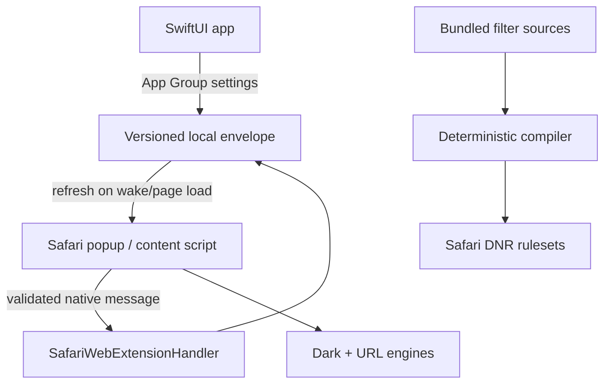

# PRISM

PRISM is an independent, open-source iPhone/iPad Safari extension that combines declarative privacy protection, cautious tracking-parameter removal, and perceptual website dark mode. It has no account, backend, telemetry, analytics SDK, or remote executable code.

Status: the source, deterministic browser-engine tests, XcodeGen definition, and CI workflows are implemented. Linux-side validation passes. An Apple build has not yet been run in this Windows/Linux workspace; Xcode generation, Swift compilation, Safari loading, signing, and real-device behavior still require the included macOS CI workflows.

## Implemented vertical slice

- Manifest V3 Safari Web Extension embedded in a real SwiftUI app;
- three deterministic declarative rulesets: Minimal, Balanced, and Strict;
- validated custom domain block/allow and element-hiding rules;
- an in-page element picker with stable-selector generation, preview, confirmation, and local rule persistence;
- global and per-domain settings stored locally through a shared App Group envelope;
- versioned, allowlisted native messaging through `SafariWebExtensionHandler`;
- known-parameter URL cleaning with OAuth, authentication, payment, invitation, reset, and signed-URL bypasses;
- native-dark detection plus OKLab/OKLCH color transformation and contrast correction;
- media protection, SVG treatment, form control color-scheme support, gradient handling, site-fix registry, and safe per-site CSS;
- incremental `MutationObserver` processing with dirty-root deduplication, bounded queueing, cooperative yielding, and a bounded color cache;
- compact accessible Safari popup and adaptive iPhone/iPad SwiftUI navigation;
- real Liquid Glass APIs on iOS/iPadOS 26+, with a documented system-material fallback on iOS/iPadOS 18–25;
- privacy-safe diagnostics and optional aggregate counters, disabled by default;
- Linux validation/tests, macOS build/tests, verified unsigned packaging, releases, and an opt-in signed App Store build workflow.

## Architecture



Detailed boundaries and lifecycle decisions are in [`ARCHITECTURE.md`](ARCHITECTURE.md). Current platform facts and limitations are in [`SAFARI_CAPABILITIES.md`](SAFARI_CAPABILITIES.md).

## Default experience

| Control | Default |
| --- | --- |
| Protection | On — Balanced |
| Dark Mode | Automatic |
| Clean URLs | On |
| Local statistics | Off |

The normal path needs no tuning. Custom rules, CSS, diagnostics, and compatibility controls are advanced features.

## Privacy and permissions

PRISM requests website access because content-script dark mode and URL cleaning must read and alter page presentation/navigation. Network blocking is executed by Safari's declarative engine. Safari—not PRISM—controls which sites and profiles may run the extension and whether it is enabled in Private Browsing.

The full data model is documented in [`PRIVACY.md`](PRIVACY.md). The extension does not persist full URLs, page text, form data, cookies, passwords, tokens, or a browsing timeline.

## Windows/Linux development

Node.js 24 is sufficient for platform-independent work:

```sh
npm ci --ignore-scripts
npm run lint:js
npm test
npm run validate
npm run test:stress
```

The filter compiler is deterministic:

```sh
npm run compile:filters
npm run compile:check
```

Do not hand-edit files in `SafariExtension/Resources/rules/`; edit `PrivacyEngine/Rules/*-rules.json` and regenerate.

## macOS/Xcode build

Required versions are pinned deliberately:

- macOS Tahoe 26.2 or later;
- Xcode 26.6;
- XcodeGen 2.46.0.

```sh
brew install xcodegen
xcodegen --version
xcodegen generate
xcodebuild \
  -project PRISM.xcodeproj \
  -scheme PRISM \
  -sdk iphonesimulator \
  -configuration Debug \
  CODE_SIGNING_ALLOWED=NO \
  build
```

`project.yml` is the source of truth; the generated `.xcodeproj` is ignored.

Safari runtime resources are represented as explicit files with `copyFiles` resource destinations and fixed subpaths. Nested `type: folder` entries are deliberately forbidden because XcodeGen 2.46.0 can generate incorrect source-root file references for them. Linux validation checks every source/configuration path and proves the intended bundle-relative path of every extension resource before project generation.

## CI build path

| Workflow | Purpose |
| --- | --- |
| `validate.yml` | JSON/plist/manifest/security checks, JS tests, stress tests |
| `build.yml` | Linux gate, XcodeGen, simulator build, XCTest, iphoneos build, extension embedding checks, extracted unsigned-IPA verification |
| `test.yml` | XCTest on a dynamically selected available iPhone simulator |
| `benchmark.yml` | deterministic pure-engine stress measurements as artifacts |
| `release.yml` | tagged source archive, verified unsigned package, checksums, release notes |
| `signed-build.yml` | manual, secret-backed App Store archive/export path |

GitHub's `macos-26` image is used with `/Applications/Xcode_26.6.app`. Xcode 27 is a preview as of this repository's capability review and is intentionally excluded.

## Unsigned IPA artifact

The unsigned workflow builds an actual `iphoneos` app, verifies its executable, extension executable, extension point, manifest, and runtime resources, then packages:

```text
Payload/
└── PRISM.app/
    ├── Info.plist
    ├── PRISM
    └── PlugIns/
        └── PRISMSafariExtension.appex/
            ├── Info.plist
            ├── manifest.json
            └── PRISMSafariExtension
```

The packaging step extracts the completed IPA into a clean temporary directory and reruns the executable, plist, manifest, rule, JavaScript, engine-resource, and extension-embedding checks against the extracted app. This archive is for inspection and CI evidence. It is not installable on an ordinary device without valid Apple signing and provisioning. Renaming an arbitrary ZIP is not treated as a build.

## Optional signed build

The manual signed workflow requires these GitHub secrets:

- `APPLE_DISTRIBUTION_CERTIFICATE_P12_BASE64`;
- `APPLE_DISTRIBUTION_CERTIFICATE_PASSWORD`;
- `APP_STORE_CONNECT_PRIVATE_KEY_P8`;
- `APP_STORE_CONNECT_KEY_ID`;
- `APP_STORE_CONNECT_ISSUER_ID`;
- `APPLE_TEAM_ID`.

The workflow uses a temporary keychain, Xcode's archive/export flow, App Store Connect authentication for automatic provisioning, and deletes temporary signing material in an `always()` cleanup step. Do not place signing files in the repository.

## Safari activation

After installing a signed build:

1. Open the PRISM app once.
2. Go to Settings → Apps → Safari → Extensions.
3. Enable PRISM and choose its website access.
4. Optionally allow it in Private Browsing; Safari keeps this off by default for extensions with webpage access.
5. Reload already-open pages after changing app-only settings.

Apple provides no supported API for PRISM to silently enable itself or grant website access.

## Filter licensing

The current baseline is original MIT-licensed project data, not a copied third-party or proprietary list. See [`FILTERS.md`](FILTERS.md). External filter updates are not enabled until a source's redistribution/transformation license and atomic update behavior are documented and tested.

## Current limitations

- Swift/Xcode/Safari execution has not been validated in this non-macOS workspace; CI must supply that evidence.
- App-only changes cannot push reliably into an already-running iOS webpage; the next page load/popup wake refreshes state.
- A newly added per-site relaxation may not affect requests that occurred before the first page-load synchronization; subsequent navigations use the persisted dynamic rule.
- Exact historical blocked-request totals are intentionally omitted because Safari does not expose a complete durable request stream.
- The bundled blocker is deliberately small; it is an auditable MVP, not comprehensive filter-list coverage.
- Visual regression, physical-device battery profiling, and App Store submission validation still require macOS/device infrastructure.

## Screenshots

Real screenshots will be added only after the app launches in a verified Xcode/iOS run. Concept art is not substituted for runtime evidence.

## Security and contributing

Read [`SECURITY.md`](SECURITY.md) before reporting a vulnerability and [`CONTRIBUTING.md`](CONTRIBUTING.md) before changing engines, permissions, or filter sources. License: [MIT](LICENSE).
